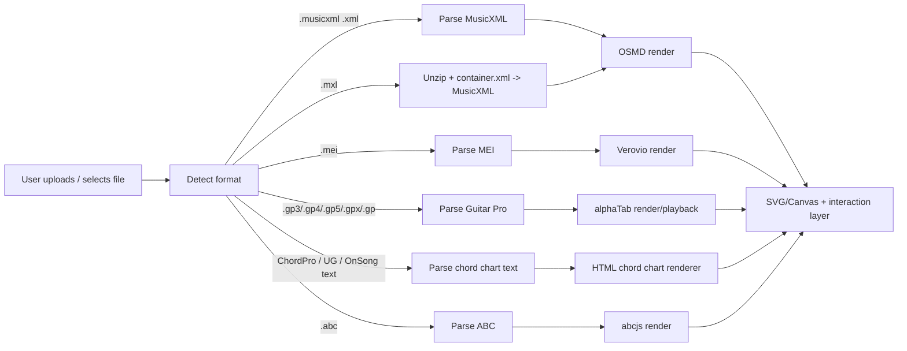
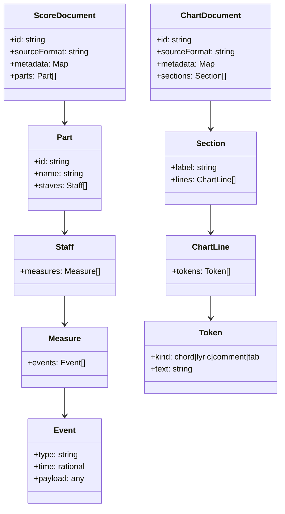

# Music Notation and Chord-Chart Formats for the OSMD and VexFlow Ecosystem

## Executive summary and integration roadmap

A practical way to think about music content ingestion for apps is that you are really supporting **three different “worlds”**:

- **Full-score notation interchange** (multi-staff, polyphony, articulations, layout hints): dominated by **MusicXML** (plus its compressed container **MXL**) as a widely adopted interchange format maintained by the entity["organization","W3C","web standards org"] Music Notation Community Group. citeturn5search1turn5search4turn5search0turn16view0  
- **Rendered scholarly/edition encodings** (metadata-rich, editorial apparatus, critical editions): commonly represented with **MEI**, with fast browser rendering typically done via entity["organization","Verovio","mei engraving toolkit"]. citeturn8search16turn25search0turn25search2turn22search0  
- **Text-native performance charts** (lead sheets, chord charts, tabs): a mix of **ChordPro**, “Ultimate Guitar–style” chord sheets, OnSong-style text, and ASCII tablature conventions, with modern JS parsers such as entity["organization","ChordSheetJS","chord chart parser library"] covering multiple variants. citeturn12view0turn9search0turn9search21turn23search1  

Within the OSMD/VexFlow ecosystem specifically, it’s important to separate concerns:

- **VexFlow** is a **rendering engine** (TypeScript) that draws notation to Canvas/SVG; it does not define a standard interchange file format by itself. citeturn24view0turn16view0turn16view0  
- **OSMD** is a **MusicXML→renderer pipeline**: it parses MusicXML and uses VexFlow for engraving/layout, acting as a “missing link” between MusicXML interchange and VexFlow rendering. citeturn11view0turn18view0  

### Recommended first three formats to implement for broadest coverage

If your goal is maximum real-world coverage quickly (and you have no platform/budget constraints), the best “first 3” are:

1. **MusicXML (+ MXL)** for full notation and many lead-sheet style scores (including chord symbols and tablature constructs in MusicXML). citeturn5search1turn5search4turn5search0turn20search5turn7search21turn11view0  
2. **ChordPro + Ultimate Guitar–style chord sheets** (text-based chord charts) because they dominate gig workflows and are easy to capture, edit, diff, version-control, and transpose. citeturn23search1turn23search8turn12view0turn9search0  
3. **Guitar Pro family (GP3/GP4/GP5/GPX/GP)** because it’s a major tab ecosystem; when you support it you immediately unlock lots of guitar/bass/drum “pro tab” content and technique details. Rendering/parsing is well-covered across platforms by entity["organization","alphaTab","guitar pro tab renderer"]. citeturn6search36turn20search31turn10search9turn17view0turn20search3turn20search0  

### Concise integration roadmap

A robust, format-agnostic integration roadmap looks like:

- **Detection**: sniff by extension + magic bytes (ZIP, XML prolog, etc.), and fall back to content heuristics (ChordPro directives, ABC headers like `X:` / `K:`, etc.). citeturn5search1turn5search4turn21view0turn23search1  
- **Parsing**: parse into a **canonical internal model** (events/voices/measures for notation; sections/lines/chords for chord charts), keeping a lossless “source map” back to original tokens when possible (critical for editors). citeturn12view0turn11view0  
- **Rendering**: choose the renderer per model:
  - MusicXML → OSMD → SVG/Canvas citeturn11view0turn9search34  
  - MEI → Verovio → SVG citeturn8search16turn25search0  
  - Guitar Pro → alphaTab → Canvas/SVG/audio playback citeturn10search9turn20search0turn20search3  
  - Chord charts → HTML/CSS (plus optional chord-diagram renderer) citeturn12view0turn23search8  
- **Caching & performance**: cache parsed AST + rendered SVG per layout settings (zoom, page width), and stream large binaries (GP, MSCZ) rather than copying buffers blindly. OSMD explicitly notes that rendering “takes some time” and provides server-side/browserless rendering options. citeturn11view0  

## OSMD and VexFlow ecosystem overview

VexFlow is a TypeScript library that renders music notation and guitar tablature to **HTML Canvas or SVG**, in browsers and Node.js contexts. citeturn24view0turn16view0 Its native model is “constructive”: you build staves, voices, and notes via API calls (low-level) or via its higher-level helpers like **Factory** and **EasyScore**. citeturn24view0

OSMD sits above that: it positions itself as the bridge between **MusicXML** and **VexFlow**, parsing MusicXML into a data model and then rendering via VexFlow (including features like tablature and many MusicXML tags, with some limitations). citeturn11view0turn5search4

The VexFlow-adjacent “notation languages” you’ll see in the ecosystem fall into two categories:

- **VexFlow helper grammars**: *EasyScore* is a compact notation string grammar used to quickly create notes/voices without writing every object manually. citeturn24view0  
- **VexFlow-oriented text languages**: **VexTab** is a text-based language intended for “writeability” and supports guitar techniques such as hammer-ons/pull-offs/taps/slides in its syntax (e.g., `6h8p6`). It is described as an open specification, but its reference implementation has non-commercial licensing constraints. citeturn7search3turn10search19turn22search3turn22search27  

image_group{"layout":"carousel","aspect_ratio":"16:9","query":["OpenSheetMusicDisplay MusicXML rendering screenshot","VexFlow SVG music notation example","Verovio MEI to SVG screenshot","alphaTab Guitar Pro rendering screenshot"],"num_per_query":1}

### Entity table

| Entity | What it is in this ecosystem | Primary role | License signal (for integration risk) |
|---|---|---|---|
| entity["organization","Verovio","mei engraving toolkit"] | MEI-first engraving toolkit with browser/WASM builds | Parse/render MEI (and some imports) → SVG | LGPLv3 (library), with separate tools having different licenses (e.g., editor prototype). citeturn25search0turn25search2turn25search3 |
| entity["organization","alphaTab","guitar pro tab renderer"] | Cross-platform tab/notation renderer targeting Guitar Pro-family files | Parse Guitar Pro → render + playback | MPL-2.0 (file-level copyleft). citeturn17view0turn10search5turn20search0 |
| entity["organization","abcjs","abc notation js library"] | Browser library for ABC notation rendering and MIDI generation | Parse ABC → render notation (+ options like tablature) | MIT. citeturn15view0turn13view0 |
| entity["organization","ChordSheetJS","chord chart parser library"] | Parser/formatter toolkit for chord sheets (ChordPro, UG-style, chords-over-words, etc.) | Parse chord charts → HTML/text/PDF | GPL-2.0. citeturn12view0 |
| entity["organization","Library of Congress","washington, dc, us"] | Preservation-oriented format notes for MusicXML/MEI | “Reality check” on format families, MIME types, sustainability | Not a code dependency; good for archival/metadata guidance. citeturn5search12turn22search0 |

## Database-ready catalog of relevant formats

This catalog emphasizes (1) OSMD/VexFlow adjacency, (2) text/binary chord/tab formats suitable for apps, and (3) primary sources for specs and MIME signals. MusicXML’s official media types are registered with IANA, and the W3C MusicXML documentation specifies recommended extensions and the compressed MXL container structure. citeturn5search0turn5search1turn5search4turn5search16 ChordPro’s spec and common extensions are documented by the ChordPro project itself, and OnSong documents both bracketed chords and “chords over lyrics” ingestion patterns used widely in the field. citeturn23search1turn9search0turn9search8 ABC’s standard documents chord symbols and lyric alignment (`w:`), and IANA registers `text/vnd.abc` as an ABC media type. citeturn21view1turn21view2turn23search0

### Format records

Each record below is intended to map cleanly into a database row (columns: **extensions**, **mime_types**, boolean capability flags, **recommended_js_ts**, **license**, **parser_complexity**, etc.).

| Format | Text / Binary | Common extensions | Common MIME types (official where known) | Primary/official spec or reference | OSMD / VexFlow relation | Prominent implementations/parsers (JS/TS first) | Typical use cases | Chords / lyrics / tab / techniques | Licensing + maturity | Integration notes (complexity, performance, recommended parser) |
|---|---|---|---|---|---|---|---|---|---|---|
| **MusicXML (uncompressed)** | Text (XML) | `.musicxml` (recommended), legacy `.xml` citeturn5search4 | `application/vnd.recordare.musicxml+xml` (IANA) citeturn5search0turn5search16 | W3C MusicXML reference & tutorials citeturn5search4turn20search5turn7search21turn20search1 | **Native in OSMD**: OSMD parses MusicXML and renders via VexFlow citeturn11view0 | **JS/TS**: OSMD (render) citeturn11view0turn18view0; also general XML parsers + custom mapping. **Other**: LilyPond includes `musicxml2ly` importer. citeturn8search1 | Full scores, lead sheets, educational excerpts citeturn11view0turn20search28 | Chords via `<harmony>` citeturn20search1; tablature + techniques in spec examples citeturn7search21; lyrics supported (tooling extracts lyrics) citeturn8search1turn11view0 | Open spec under W3C process; widely used interchange citeturn23search30turn11view0 | **Complexity: High** (full notation). **Recommended**: OSMD for rendering; keep raw XML + a normalized internal model. OSMD notes rendering cost and offers SVG/PNG output (including server-side). citeturn11view0 |
| **MXL (compressed MusicXML)** | ZIP container (binary) containing XML | `.mxl` citeturn5search4turn5search1 | `application/vnd.recordare.musicxml` (IANA) citeturn5search16turn5search1 | W3C “Compressed .MXL Files” tutorial + container structure citeturn5search1turn5search4turn5search32 | Same as MusicXML (OSMD loads MusicXML; typical pipelines unzip then parse) citeturn11view0 | **JS/TS**: OSMD uses ZIP handling in its build/deps citeturn10search16turn11view0 | Distribution-friendly sheet music interchange citeturn5search1turn5search13 | Same capabilities as MusicXML once unpacked citeturn5search1turn7search21 | Same as MusicXML | **Complexity: Medium** (container + XML). **Integration**: detect ZIP + `META-INF/container.xml`, then parse the rootfile. citeturn5search1turn5search4 |
| **MEI** | Text (XML) | `.mei` (widely used) citeturn23search2turn22search0 | No IANA registration; commonly treated as XML; some ecosystems use unregistered `application/vnd.mei+xml` citeturn23search2turn23search6 | MEI project + guidelines citeturn22search4turn7search6turn22search0 | **Unrelated to OSMD/VexFlow natively**; rendered via Verovio; conversion pipelines exist (MEI↔MusicXML tools and services). citeturn25search0turn8search15turn8search3 | **JS/TS**: Verovio (WASM) renders MEI→SVG citeturn25search0turn25search1turn8search16 | Digital editions, musicology, archives, engraving pipelines citeturn22search0turn8search19 | String tablature-related modules exist (tuning/course/string) citeturn7search2 | Open standard (community-driven). Verovio is LGPLv3. citeturn25search0turn25search2 | **Complexity: High** (rich scholarly model). **Recommended**: Verovio for web rendering; consider converting MEI→MusicXML only if you must unify on OSMD. citeturn25search0turn8search3 |
| **MuseScore internal formats** | Mixed: XML + ZIP container | `.mscx` (XML), `.mscz` (ZIP of `.mscx`) citeturn2search1turn2search0 | Typically `application/zip` or `application/xml` (no standard MIME) citeturn23search6 | MuseScore handbook notes MSCX is not stable across versions and recommends MusicXML for interchange citeturn2search1turn2search0 | **Indirect**: export MusicXML from MuseScore → OSMD citeturn2search1turn11view0 | Export pipeline rather than in-app JS parsing (common approach) citeturn2search1turn2search0 | Authoring + interchange via exports | Depends on exported format; MusicXML can carry chords/tab, etc. citeturn7search21turn20search1 | MuseScore file formats are app-defined; stability caveat is explicit citeturn2search1 | **Complexity: High** if you parse MSCX/MSCZ directly. **Recommended**: treat MuseScore as a source that exports MusicXML/MEI, not as a primary ingestion format. citeturn2search1 |
| **ABC notation** | Text | `.abc` citeturn22search30 | `text/vnd.abc` (IANA) citeturn23search0turn23search7 | ABC standard v2.1 (notably: chord symbols and `w:` lyrics alignment) citeturn21view1turn21view2turn22search34 | Not OSMD/VexFlow-native; typically rendered with abcjs or converted elsewhere | **JS/TS**: abcjs renders ABC in-browser and provides examples/docs citeturn13view0turn15view0 | Folk/trad tunes, melody + chords, lightweight notation authoring citeturn22search2turn22search10 | Chord symbols in standard citeturn21view1; lyrics (`w:`/`W:`) in standard citeturn21view2; abcjs supports tablature rendering option citeturn13view0 | abcjs is MIT citeturn15view0; ABC is long-lived text standard with registered MIME citeturn23search0turn22search10 | **Complexity: Medium**. **Recommended**: abcjs for rendering; keep a tune-header parser for metadata; enforce standard fields (`X:`, `T:`, `K:`) where possible. citeturn21view0turn13view0 |
| **LilyPond** | Text | `.ly` (convention) citeturn20search20turn4search16 | Typically `text/plain` | LilyPond manuals for input structure and compilation citeturn4search24turn4search8turn20search20 | Not OSMD/VexFlow-native; common approach is compile LilyPond → PDF/SVG or convert from MusicXML using `musicxml2ly` citeturn4search25turn8search1 | **JS/TS**: usually indirect (server-side compile). Node wrappers exist (e.g., Lilynode). citeturn4search37 | Engraving-quality scores, publishing workflows | Very rich (lyrics/chords/tab supported in LilyPond ecosystem), but often as rendering outputs rather than app-native parsing citeturn4search24turn8search1 | LilyPond published under GNU GPL citeturn27search4turn27search7 | **Complexity: Very high** to parse fully. **Recommended**: treat `.ly` as “source code”; integrate by sandboxed compilation (Docker/jail) if you need LilyPond support. citeturn4search25turn4search9 |
| **ChordPro (v6 ecosystem)** | Text | Common: `.cho`, `.crd`, `.chopro`, `.chord`, `.pro` citeturn23search1turn9search1 | Typically `text/plain` | ChordPro introduction + directives spec citeturn23search1turn23search8 | Indirect: not OSMD/VexFlow-specific; displayed as text charts or transformed to lead-sheet layouts | **JS/TS**: ChordSheetJS parses ChordPro; supports tab environments and directive metadata parsing citeturn12view0 | Lead sheets, chord charts, worship/band charts, editable transposition workflows | Chords inline `[]` + metadata directives `{}` citeturn23search8turn9search1; “tab” environments exist in ecosystem tooling citeturn12view0turn23search15 | Reference ChordPro program is GPL/Artistic dual (implementation), format itself is a spec; ChordSheetJS is GPL-2.0 citeturn19view0turn12view0 | **Complexity: Low–Medium**. **Recommended**: ChordSheetJS if GPL-2.0 is acceptable; otherwise implement a focused parser for the directives and bracketed chords. citeturn12view0turn9search0 |
| **Ultimate Guitar–style chord sheets** | Text | Usually `.txt` or site/app content | `text/plain` | De facto format; supported explicitly by ChordSheetJS “UltimateGuitarParser” citeturn12view0 | Unrelated to OSMD/VexFlow | **JS/TS**: ChordSheetJS UltimateGuitarParser citeturn12view0 | Web-sourced chord sheets, quick gig charts | Chords-over-words + section headers like `[Chorus]` in many cases citeturn12view0 | Same as parser license | **Complexity: Low** if you accept heuristic parsing. **Recommended**: ChordSheetJS UG parser, then normalize into your internal chord-chart model. citeturn12view0 |
| **ASCII “chords over lyrics”** | Text | `.txt`, `.tab` sometimes citeturn7search10turn9search8 | `text/plain` | Convention (not a formal spec); OnSong documents ingestion and conversion | Indirect | **JS/TS**: ChordSheetJS “ChordsOverWordsParser” citeturn12view0 | Legacy charts, quick copy/paste | Chords aligned by spaces above lyric line; not robust under proportional fonts citeturn9search8turn12view0 | Depends on parser | **Complexity: Medium** because alignment is ambiguous. **Recommended**: parse to token grid, then re-render in a measured layout engine (ChordSheetJS provides measured formatters in beta). citeturn12view0 |
| **Inline-bracket chords (ChordPro-style without directives)** | Text | `.txt` | `text/plain` | Convention; OnSong notes bracketed chords are its internal standard and also used by ChordPro citeturn9search0turn9search8 | Indirect | Many parsers accept bracketed chords as a subset of ChordPro citeturn9search0turn12view0 | Most modern text chord charts | Chords inside `[]` on lyric line citeturn9search0 | Depends on implementation | **Complexity: Low**. **Recommended**: treat as ChordPro-lite; parse chords + lyric segments. citeturn9search0 |
| **OnSong text format** | Text | `.onsong` citeturn27search14turn9search21 | `text/plain` | OnSong format docs (metadata section + chord handling) citeturn9search21turn9search33 | Indirect | Often best handled as “text chord chart” (parse metadata + chord syntax) citeturn9search21turn9search0 | Gig charts, setlists, performance workflows | Supports bracketed chords and also chords-over-lyrics ingestion citeturn9search21turn9search8 | Proprietary app ecosystem; format is documented for users citeturn9search21turn27search14 | **Complexity: Low–Medium**. **Recommended**: parse OnSong metadata + reuse your bracket-chord parser; treat formatting directives as optional. citeturn9search33turn9search4 |
| **OnSong Archive / Backup** | Binary container | `.archive`, `.onsongarchive`, `.backup` citeturn6search2turn6search6 | App-specific | OnSong docs explicitly state archive is binary and only readable by OnSong citeturn6search6turn6search2 | Unrelated | N/A | App library portability | Contains “everything needed” for OnSong restore/transfer, but not intended for third-party parsing citeturn6search2turn6search6 | Closed/app-defined | **Complexity: Very high**. **Recommended**: don’t parse; advise users to export as ChordPro/OnSong text instead. citeturn6search6turn6search14 |
| **OpenSong song XML** | XML | Often no extension; OpenSongApp mentions `.ost` or none; OpenSong desktop docs describe XML layout citeturn27search1turn27search11turn27search5 | `application/xml` (typical) citeturn23search6 | OpenSong file formats page (XML structure) citeturn27search5turn27search1 | Indirect | **Other languages**: converters exist (e.g., OpenSong→ChordPro tools in Python) citeturn27search18 | Worship lyrics + sections; projection-ready structures | Stores song properties, lyrics, etc. in XML tags citeturn27search1turn27search5 | Depends on OpenSong implementation | **Complexity: Medium** (XML + idiosyncratic fields). **Recommended**: transform OpenSong XML → your chord/lyrics model or → ChordPro as an interchange layer. citeturn27search18turn27search5 |
| **OpenLyrics** | XML | `.xml` commonly | `application/xml` (typical) citeturn23search6 | OpenLyrics docs (features include chords + schema) citeturn5search5turn5search2 | Indirect | Typically consumed by worship apps; conversion toolchains exist in XML/XSLT citeturn5search11 | Lyrics-first interchange between worship tools | Chords supported (chord markup is evolving; chords are “free texts” in 0.8 per issue discussion) citeturn5search5turn5search8 | Spec is open; implementations vary citeturn5search5 | **Complexity: Medium**. **Recommended**: parse as XML; treat chord tokens as strings unless your product needs strict chord grammar. citeturn5search8turn5search2 |
| **SongBook (LinkeSOFT)** | Text (ChordPro usage) + tabs | `.pro`, `.chopro`, `.txt`, `.tab` documented by vendor citeturn7search10turn7search4turn7search0 | `text/plain` | Vendor documentation states SongBook stores songs in ChordPro format and supports tab files citeturn7search0turn7search4turn7search10 | Indirect | Use ChordPro tooling for ingestion | Personal gig libraries, offline charts | ChordPro chords in `[]`; tab files supported citeturn7search0turn7search10 | App-defined, but relies on ChordPro conventions | **Complexity: Low** if treated as ChordPro + ASCII tab. **Recommended**: parse as ChordPro when possible; fall back to “chords over lyrics” for `.tab`. citeturn7search10turn9search8 |
| **SongbookPro database export** | Mixed (app formats + imports) | `.sbp`, `.sbpbackup` + imports ChordPro/OnSong exports citeturn5search15turn6search3turn6search11 | App-specific | SongbookPro docs list supported import formats and proprietary backups citeturn5search15turn6search3turn6search11 | Indirect | Not designed as an interchange format | Personal libraries + setlists | Interchange best via ChordPro/OnSong exports rather than `.sbp` citeturn5search15turn6search11 | Proprietary container | **Complexity: High** if you attempt `.sbp`. **Recommended**: ingest the exported ChordPro/OnSong text instead. citeturn6search11turn9search25 |
| **Guitar Pro 3–5** | Binary | `.gp3`, `.gp4`, `.gp5` citeturn20search27turn20search31 | App-specific | No public official spec; supported by alphaTab | Indirect | **JS/TS**: alphaTab supports GP 3–5 and renders effects/techniques citeturn10search9turn20search3turn20search0; **Python**: PyGuitarPro reads/writes GP3–GP5 citeturn20search27 | Pro tabs, lessons, practice playback | Rich technique support (bends, slides, hammer/pull, etc.) in alphaTab docs citeturn20search3turn20search0 | alphaTab MPL-2.0 citeturn17view0 | **Complexity: Medium–High** (reverse-engineered binaries). **Recommended**: alphaTab unless you need a permissive license; then separate parsing/ rendering strategies or server-side conversion. citeturn17view0turn20search0 |
| **Guitar Pro 6–8 family** | Mixed (often ZIP/XML + binary variants) | `.gpx`, `.gp` (and related) citeturn6search8turn6search20turn6search36 | App-specific | Vendor-defined; widely used; alphaTab supports many formats | Indirect | **JS/TS**: alphaTab; other ecosystems exist per platform citeturn10search9turn20search0 | Modern pro tabs, richer instrumentation | Strong technique + playback hooks in alphaTab docs citeturn20search3turn20search0 | alphaTab MPL-2.0; Guitar Pro ecosystem is proprietary content-wise citeturn17view0turn6search36 | **Complexity: High**. **Recommended**: alphaTab for breadth; isolate the library behind an adapter to manage MPL obligations. citeturn17view0turn25search2 |
| **Power Tab (.ptb)** | Binary | `.ptb` citeturn6search8turn3search1 | App-specific | Power Tab developer/forum references exist; Power Tab dev center documents features like bends; third-party libs exist citeturn3search1turn3search0 | Indirect | **JS/TS**: alphaTab supports PowerTab import; **.NET**: Power Tab .NET developer center documents format-related capabilities citeturn3search0turn10search9 | Legacy tab archives | Technique-wise depends on file content; some tooling notes bends import support in dev docs citeturn3search0turn20search0 | Mixed; ecosystem historically fragmented | **Complexity: Medium**. **Recommended**: treat as “legacy import”; use alphaTab if you already depend on it for GP. citeturn10search9turn3search0 |
| **Humdrum / `**kern`** | Text | `.krn` recommended citeturn22search1turn22search29 | `text/plain` | Humdrum `**kern` reference (file extension guidance) citeturn22search29turn22search1 | Indirect; commonly rendered (web) via Verovio Humdrum ecosystem | **JS/TS**: Humdrum Notation Plugin examples exist; Verovio ecosystem includes Humdrum viewer citeturn22search13turn8search4turn8search8 | Research datasets, symbolic corpora, analysis pipelines | Strong for notated pitches/rhythms; chord/lyrics vary by encoding conventions | Open research format family; mature in academia citeturn22search5turn22search21 | **Complexity: Medium**. **Recommended**: if you already use Verovio, leverage its Humdrum pathways; otherwise parse `**kern` with existing humdrum tooling and convert to MusicXML/MEI for rendering. citeturn8search4turn25search0 |
| **VexTab** | Text | Often embedded; no universal extension; commonly stored as `.txt` or embedded blocks citeturn22search23turn22search3 | `text/plain` | VexTab tutorial (syntax incl. h/p/t/s techniques) citeturn7search3turn22search7 | **VexFlow-adjacent**: VexTab parses text to VexFlow rendering | **JS**: vextab reference implementation repo citeturn22search3 | Embeddable notation/tab snippets for web docs, lessons | Technique tokens explicit (`h`, `p`, `t`, `s`) citeturn7search3 | Reference implementation is free for non-commercial use; commercial requires permission citeturn10search19turn22search27 | **Complexity: Low–Medium**. **Recommended**: treat as an authoring convenience; beware licensing constraints for commercial apps. citeturn10search19 |
| **iReal Pro “irealb://” chord charts** | Text-like encoded string in URL | `irealb://` links (export format) citeturn4search7 | Custom URL scheme | iReal Pro developer docs for embedding/export links citeturn4search7 | Unrelated | **Other languages**: parsers in Rust/Python exist; iReal Pro publishes embedding guidance citeturn4search3turn4search11turn4search7 | Jazz practice charts, quick comping progressions | Chords only (not full notation); iReal Pro itself notes you cannot import MusicXML/PDF/MIDI to create charts citeturn5search31 | Proprietary ecosystem; specs are partially public via developer docs | **Complexity: Medium** (token grammar + layout conventions). **Recommended**: parse into a bar-grid chord model; render with your own grid UI rather than VexFlow. citeturn4search7turn4search27 |
| **MNX (emerging)** | Likely text (JSON/XML-like spec evolution) | TBD | TBD | W3C MNX community spec drafts citeturn3search2 | Future-oriented; not OSMD-native today | Experimental | Next-gen interchange candidate | Intended for notation interchange; implementation surface still evolving | Early-stage | **Complexity: High** (moving target). **Recommended**: track only; don’t commit core ingestion to MNX yet. citeturn3search2 |
| **GUIDO Music Notation (GMN)** | Text | Typically `.gmn` or embedded | `text/plain` | Guido format docs describe GMN as a plain-text formal language for score-level representation citeturn4search10turn4search14 | Unrelated | Implementations in GuidoLib (C++), plus utilities; some web integrations exist historically citeturn4search2turn4search10 | Research + specialized engraving pipelines | Supports score-level constructs; chord/tab depends on encoding patterns | Open-source project | **Complexity: Medium–High**. **Recommended**: treat as niche; integrate via conversion to MusicXML/MEI if needed. citeturn4search10turn8search22 |
| **LRC v2 draft (synced lyrics w/ chords)** | Text | Typically `.lrc` variants | `text/plain` | Draft spec in public repo mentions chords + metadata ambitions citeturn5search22 | Unrelated | Early-stage | Lyric timing + chord overlays | Lyrics-first; chord semantics immature | License is restrictive per draft repo notes citeturn5search22 | **Complexity: Low–Medium**. **Recommended**: only if you need karaoke-style timed lyrics with chord overlays; otherwise stick to ChordPro/OpenLyrics. citeturn5search22turn5search5 |

## Comparative matrix for format selection

This matrix is optimized for “what should I implement next?” decisions, especially for web/TypeScript stacks.

| Format | Text / Binary | Chord support | Lyrics support | Tablature support | Technique specificity (bends/slides/etc.) | Parse complexity | Strong JS/TS parser available? | Recommended JS/TS stack | Typical license risk |
|---|---:|---:|---:|---:|---:|---|---|---|---|
| MusicXML | Text (XML) | Yes (`<harmony>`) citeturn20search1 | Yes (tooling extracts lyrics; OSMD can hide lyrics) citeturn8search1turn11view0 | Yes (tablature examples in spec) citeturn7search21 | Yes (e.g., hammer-on/pull-off elements) citeturn7search8turn7search21 | High | Yes | OSMD citeturn11view0turn18view0 | Low (BSD-3-Clause for OSMD) citeturn18view0turn11view0 |
| MXL | ZIP+XML | Yes | Yes | Yes | Yes | Medium | Yes | OSMD + unzip/container handling citeturn5search1turn10search16 | Low |
| MEI | Text (XML) | Yes (encoding-dependent) | Yes | Yes (stringtab modules) citeturn7search2turn7search6 | Yes (encoding-dependent) | High | Yes | Verovio citeturn25search0turn25search2 | Medium (LGPL linking compliance) citeturn25search2 |
| ABC | Text | Yes (chord symbols in standard) citeturn21view1 | Yes (`w:`/`W:`) citeturn21view2 | Limited; abcjs offers tablature rendering option citeturn13view0 | Limited (extensions vary) | Medium | Yes | abcjs citeturn13view0turn15view0 | Low (MIT) citeturn15view0 |
| ChordPro | Text | Yes | Yes | ASCII tab environments in ecosystem tooling citeturn12view0turn23search15 | Low semantic technique (tab is free-form) | Low–Medium | Yes | ChordSheetJS citeturn12view0 | High (GPL-2.0) citeturn12view0 |
| UG-style chord sheets | Text | Yes | Yes | Sometimes ASCII tab blocks | Low semantic technique | Low | Yes | ChordSheetJS UG parser citeturn12view0 | High (GPL-2.0) |
| OnSong text | Text | Yes | Yes | Via tab-like sections | Low semantic technique | Low–Medium | Indirect | Parse as ChordPro-lite + metadata citeturn9search21turn9search0 | Low |
| Guitar Pro family | Binary / mixed | Yes | Yes (varies) | Yes | Strong technique support (alphaTab docs list effects) citeturn20search3turn20search0 | Medium–High | Yes | alphaTab citeturn10search9turn17view0 | Medium (MPL-2.0 obligations) citeturn17view0 |
| Power Tab (.ptb) | Binary | Limited | Limited | Yes | Medium | Medium | Indirect | alphaTab (as importer) citeturn10search9turn3search0 | Medium |
| `**kern` | Text | Varies | Varies | Not primary | Varies | Medium | Indirect | Verovio Humdrum toolchain / plugin ecosystems citeturn8search4turn22search13turn25search0 | Medium |
| VexTab | Text | Yes (depends on usage) | Limited | Yes | Explicit (`h/p/t/s`) citeturn7search3 | Low–Medium | Yes | vextab → VexFlow citeturn22search3turn10search19 | High for commercial (non-commercial free) citeturn10search19turn22search27 |
| iReal Pro links | Encoded text | Yes | No | No | No | Medium | Not mainstream in JS | Use non-JS parser or reimplement grammar guided by dev docs citeturn4search7turn4search3 | Medium (proprietary ecosystem) citeturn4search7 |

## Parser and renderer integration patterns with code examples

### Reference integration flow (mermaid)



### Canonical model strategy (mermaid)

A pragmatic “database-ready” internal model often benefits from splitting into two normalized domains:



### Code examples

The snippets below are intentionally “integration-shaped”: they show parsing + rendering entry points you can wrap behind adapters.

#### MusicXML / MXL → OSMD render (TypeScript)

OSMD is designed as the “missing link” between MusicXML and VexFlow and is available as an npm module; it renders MusicXML to SVG/Canvas and can output SVG/PNG even server-side. citeturn11view0turn10search16turn18view0

```ts
import { OpenSheetMusicDisplay } from "opensheetmusicdisplay";

async function renderMusicXML(urlOrFile: string | File, container: HTMLElement) {
  const osmd = new OpenSheetMusicDisplay(container, {
    backend: "svg",
    drawTitle: true,
  });

  if (typeof urlOrFile === "string") {
    await osmd.load(urlOrFile); // can be .musicxml, .xml, or .mxl depending on server setup
  } else {
    const data = await urlOrFile.arrayBuffer();
    await osmd.load(data); // ArrayBuffer path is handy for uploads and .mxl
  }

  await osmd.render();
  return osmd;
}
```

#### MEI → Verovio → SVG (TypeScript)

Verovio is an LGPL-licensed engraving toolkit that renders MEI to SVG and provides JavaScript/WASM distributions. citeturn25search0turn25search2turn8search16

```ts
import verovio from "verovio";

async function renderMEIToSVG(meiXmlText: string, target: HTMLElement) {
  const toolkit = new verovio.toolkit();
  toolkit.setOptions({
    scale: 40,
    footer: "none",
    header: "none",
  });

  toolkit.loadData(meiXmlText);
  const svg = toolkit.renderToSVG(1); // page 1
  target.innerHTML = svg;
}
```

#### ABC → abcjs (TypeScript)

ABC is a text-based notation standard with a registered MIME type `text/vnd.abc`, and abcjs renders it directly in the browser under MIT license. citeturn23search0turn15view0turn13view0turn21view1

```ts
import { renderAbc } from "abcjs";

function renderABC(abcText: string, targetElementId: string) {
  renderAbc(targetElementId, abcText, {
    responsive: "resize",
    add_classes: true,
  });
}
```

#### ChordPro / Ultimate Guitar / chords-over-lyrics → ChordSheetJS (TypeScript)

ChordSheetJS supports multiple “real-world” chord sheet dialects (ChordPro, Ultimate Guitar style, and chords-over-words) and can format as HTML/text; it also highlights that measured layout and PDF export are beta. citeturn12view0turn23search8turn9search8

```ts
import ChordSheetJS from "chordsheetjs";

type InputKind = "chordpro" | "ultimateGuitar" | "chordsOverWords";

function parseChordChart(text: string, kind: InputKind) {
  const parser =
    kind === "chordpro"
      ? new ChordSheetJS.ChordProParser()
      : kind === "ultimateGuitar"
      ? new ChordSheetJS.UltimateGuitarParser()
      : new ChordSheetJS.ChordsOverWordsParser();

  return parser.parse(text);
}

function formatChordChartAsHTML(song: any) {
  const formatter = new ChordSheetJS.HtmlDivFormatter();
  return formatter.format(song);
}
```

#### Guitar Pro (GP3/4/5/GPX/GP) → alphaTab (TypeScript)

alphaTab provides web installation paths and documents rich technique/effect rendering, including bends and slides. citeturn10search9turn20search0turn20search3turn17view0

```ts
import { alphaTab } from "@coderline/alphatab";

async function renderGuitarPro(file: File, host: HTMLElement) {
  const settings = new alphaTab.Settings();
  settings.player.enablePlayer = true;

  const api = new alphaTab.AlphaTabApi(host, settings);

  const data = await file.arrayBuffer();
  api.load(data);

  return api; // provides events for scrolling/playback integration
}
```

#### VexTab → VexFlow rendering (JavaScript/TypeScript-shaped)

VexTab’s tutorial documents technique tokens (hammer-ons/pull-offs/taps/slides) and the VexFlow site notes non-commercial constraints on the reference implementation. citeturn7search3turn10search19turn22search7

```ts
// Pseudocode: vextab reference API varies by distribution.
// Conceptually: parse VexTab -> generate VexFlow objects -> draw.

function renderVexTab(vextabText: string, canvasOrDiv: HTMLElement) {
  // const tab = new VexTab();
  // tab.parse(vextabText);
  // tab.render(canvasOrDiv);
}
```

## Emerging and ad-hoc formats worth tracking

This section lists formats that commonly appear in the wild even when they’re not “official standards,” plus a few emerging targets.

### Ad-hoc tablature conventions you will routinely ingest

If you accept pasted tabs from forums, messaging apps, or PDFs-transcribed-to-text, you’ll see recurring ASCII patterns:

- **Six-line string staff** (EADGBE) with fret numbers; technique letters like `H`/`P`/`B` are common conventions in instructional materials. citeturn20search22turn7search22  
- **Symbols for bends/slides/hammer-ons** vary across communities and editors; many readers treat them as interpretive rather than strictly machine-parseable. citeturn7search22turn20search34turn20search22  

Pragmatic ingestion strategy: treat ASCII tab as **semi-structured text**, tokenize lines, and only promote to semantic events (bend/slide/hammer) when the pattern is unambiguous—otherwise preserve as “verbatim tab block” in your internal model.

### Conversions as a first-class capability (often more valuable than parsing everything)

A recurring theme across these ecosystems is that **conversion is often more stable than native parsing**:

- W3C MusicXML docs describe the compressed MXL container and recommended extensions, making MusicXML an attractive “hub” format for interchange. citeturn5search1turn5search4  
- LilyPond explicitly ships `musicxml2ly` to import MusicXML into LilyPond, reinforcing that MusicXML is treated as a practical interchange entry point. citeturn8search1turn8search2  
- Verovio offers MusicXML→MEI conversion (with limitations) and broader conversion pipelines are discussed in its documentation. citeturn8search3turn25search13  

### Formats to “watch” rather than “support first”

- **MNX** is a W3C-community effort and a plausible future interchange target, but it remains a moving target compared with MusicXML’s established ecosystem. citeturn3search2  
- **LRC v2 drafts** demonstrate growing interest in timed lyrics + chord overlays, but licensing constraints and spec volatility make it a specialized choice. citeturn5search22  

### Licensing reality check for app integration

Licensing is often the hidden constraint in “format support”:

- OSMD is BSD-3-Clause. citeturn18view0turn11view0  
- VexFlow is MIT. citeturn16view0turn24view0  
- abcjs is MIT. citeturn15view0  
- alphaTab is MPL-2.0 (file-level copyleft). citeturn17view0turn10search5  
- ChordSheetJS is GPL-2.0 (strong copyleft), which can be a non-starter for some proprietary distribution models unless isolated appropriately. citeturn12view0  
- Verovio is LGPLv3, with guidance emphasizing dynamic linking and non-modification scenarios for proprietary products. citeturn25search2turn25search0  

In practice, this pushes many teams toward an adapter architecture: you wrap each parser/renderer behind an internal interface, and you can swap implementations if licensing or performance changes later—without rewriting your product’s domain model.